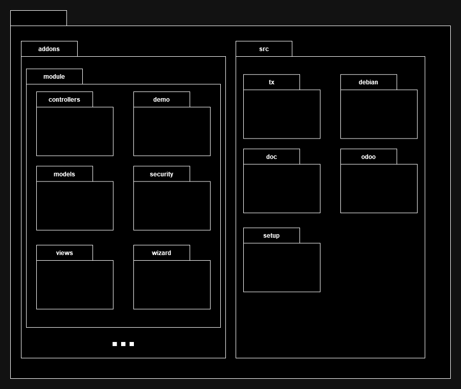
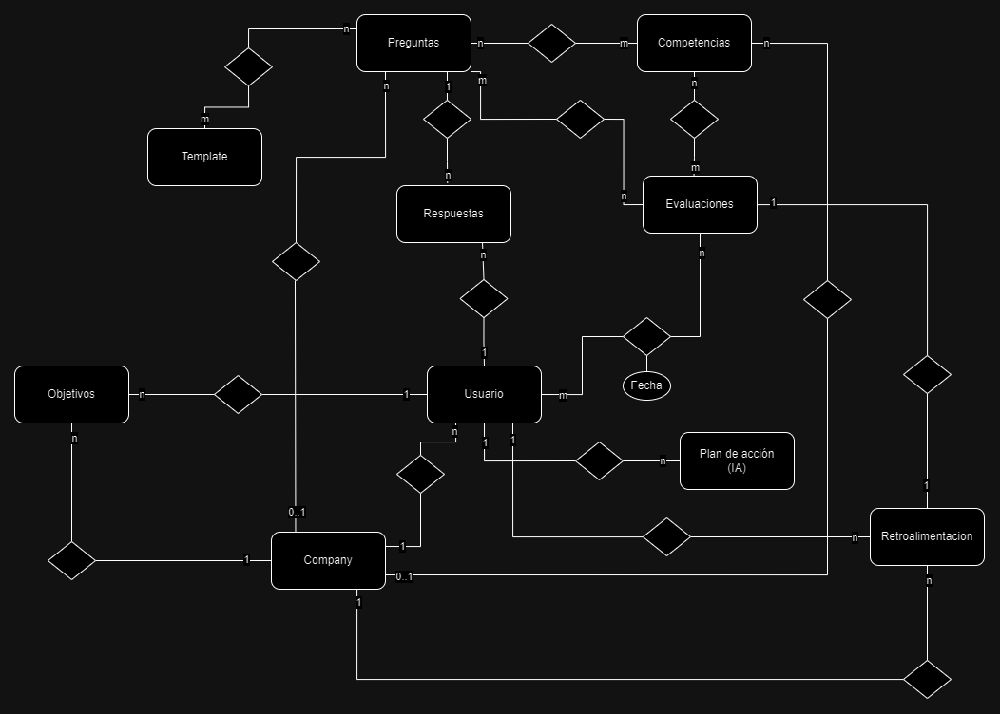

# Diagramas de Arquitectura

## Diagrama de Despliegue

## Diagrama de Paquetes

## MER

## Diccionario de Datos

**_Nombre de la entidad/tabla_** 
| _Atributo (nombre)_ | _Tipo (Tipo de dato)_ | _Descripción (breve descripción)_ |
| :---: | :---: | :---: |

**_Template_**
| _Atributo (nombre)_ | _Tipo (Tipo de dato)_ | _Descripción (breve descripción)_ |
| :---: | :---: | :---: |
| _ID_Template_ | _Int_ | _Este es un entero que sirve como identificador único para cada plantilla._ |
| _Nombre_ | _Char_ | _Este es una cadena que representa el nombre de la plantilla._ |
| _Descripción_ | _Char_ | _Este es una cadena que proporciona una descripción detallada de la plantilla._ |
| _Tipo_ | _Selection_ | _Este es una cadena que indica el tipo de plantilla._ |

**_Preguntas_**
| _Atributo (nombre)_ | _Tipo (Tipo de dato)_ | _Descripción (breve descripción)_ |
| :---: | :---: | :---: |
| _ID_Pregunta_ | _Int_ | _Este es un entero que sirve como identificador único para cada pregunta._ |
| _ID_Company_ | _Int_ | _Este es un entero que sirve como identificador único para cada compañía._ |
| _Pregunta_ | _Char_ | _Este es una cadena que representa la pregunta en sí._ |
| _Tipo_ | _Selection_ | _Este sería un cadena o un entero que indica el tipo de pregunta._ |

**_Competencias_**
| _Atributo (nombre)_ | _Tipo (Tipo de dato)_ | _Descripción (breve descripción)_ |
| :---: | :---: | :---: |
| _ID_Competencias_ | _Int_ | _Este es un entero que sirve como identificador único para cada pregunta._ |
| _ID_Company_ | _Int_ | _Este es un entero que sirve como identificador único para cada compañía._ |
| _Nombre_ | _Char_ | _Este es una cadena que representa la competencia en sí._ |
| _Descripción_ | _Selection_ | _Este sería un cadena o un entero que indica el tipo de competencia._ |

**_Respuestas_**
| _Atributo (nombre)_ | _Tipo (Tipo de dato)_ | _Descripción (breve descripción)_ |
| :---: | :---: | :---: |
| _ID_Respuestas_ | _Int_ | _Este es un entero (Int) que sirve como identificador único para cada respuesta._ |
| _ID_Preguntas_ | _Int_ | _Este es un entero que sirve como identificador único para cada pregunta._ |
| _ID_Usuario_ | _Int_ | _Este es un entero que sirve como identificador único para registrar la respuesta de cada usuario a su pregunta._ |
| _Respuesta_ | _Char_ | _Este es una cadena que representa la respuesta._ |

**_Evaluaciones_**
| _Atributo (nombre)_ | _Tipo (Tipo de dato)_ | _Descripción (breve descripción)_ |
| :---: | :---: | :---: |
| _ID_Evaluaciones_ | _Int_ | _Este es un entero que sirve como identificador único para cada evaluación._ |
| _ID_Template_ | _Int_ | _Este es un entero que sirve como identificador único para cada plantilla._ |
| _Nombre_ | _Char_ | _Este es una cadena que representa el nombre de la evaluación._ |
| _Estado_ | _Selection_ | _Esta es una selección que indica el estado actual de la evaluación._ |
| _Piso_Verde_ | _Int_ | _Límite superior del nivel verde_ |
| _Piso_Amarillo_ | _Int_ | _Limite superior del nivel Amarillo_ |
| _Piso_Rojo_ | _Int_ | _Límite superior del nivel Rojo_ |

**_Usuario (Odoo)_**
| _Atributo (nombre)_ | _Tipo (Tipo de dato)_ | _Descripción (breve descripción)_ |
| :---: | :---: | :---: |
| _ID_Usuario_ | _Int_ | _Este es un entero que sirve como identificador único para cada Usuario._ |
| _ID_Company_ | _Int_ | _Este es un entero que sirve como identificador único para cada compañía._ |
| _Nombre_ | _Char_ | _Este es una cadena que representa el nombre del usuario._ |

**_Plan de acción_**
| _Atributo (nombre)_ | _Tipo (Tipo de dato)_ | _Descripción (breve descripción)_ |
| :---: | :---: | :---: |
| _ID_PlanDeAccion_ | _Int_ | _Este es un entero que sirve como identificador único para cada Plan de acción._ |
| _ID_Usuario_ | _Int_ | _Este es un entero que sirve como identificador único para cada Usuario._ |
| _Descripción_ | _Char_ | _El contenido del plan de acción generado por la IA._ |
| _Fecha_Final_ | _Date_ | _Fecha final o límite para complir con el plan de acción._ |

**_Company (Odoo)_**
| _Atributo (nombre)_ | _Tipo (Tipo de dato)_ | _Descripción (breve descripción)_ |
| :---: | :---: | :---: |
| _ID_Company_ | _Int_ | _Este es un entero que sirve como identificador único para cada Company_ |
| _Nombre_ | _Char_ | _Nombre de la compañía_ |

**_Objetivos_**
| _Atributo (nombre)_ | _Tipo (Tipo de dato)_ | _Descripción (breve descripción)_ |
| :---: | :---: | :---: |
| _ID_Objetivo_ | _Int_ | _Este es un entero que sirve como identificador único para cada Company_ |
| _ID_Usuario_ | _Int_ | _Este es un entero que sirve como identificador único para cada Usuario._ |
| _ID_Company_ | _Int_ | _Este es un entero que sirve como identificador único para cada Company._ |
| _Título_ | _Char_ | _Título del objetivo_ |
| _Descripción_ | _Char_ | _Descripción o contenido del objetivo a cumplir._ |
| _Métrica_ | _Selection_ | _métrica que se usara para medir el avance_ |
| _Piso_ | _int_ | _Límite inferior del rango del objetivo_ |
| _Techo_ | _int_ | _Límite superior del rango de objetivo_ |
| _Avance_ | _int_ | _Avance del colaborador_ |

**_Retroalimentación_**
| _Atributo (nombre)_ | _Tipo (Tipo de dato)_ | _Descripción (breve descripción)_ |
| :---: | :---: | :---: |
| _ID_Retroalimentación_ | _Int_ | _Este es un entero que sirve como identificador único para cada Retroalimentación_ |
| _ID_Evaluaciones_ | _Int_ | _Este es un entero que sirve como identificador único para cada evaluación._ |
| _ID_Company_ | _Int_ | _Este es un entero que sirve como identificador único para cada Company_ |
| _ID_Usuario_ | _Int_ | _Este es un entero que sirve como identificador único para cada Usuario._ |
| _Retro_Evaluador_ | _Char_ | _Retroalimentación generada por el evaluador_ |
| _Retro_Colaborador_ | _Char_ | _Retroalimentación generada por el colaborador_ |
| _Estado_ | _Bool_ | _Estado de si el colaborador acepta o no_ |

**_Preguntas_Template_**
| _Atributo (nombre)_ | _Tipo (Tipo de dato)_ | _Descripción (breve descripción)_ |
| :---: | :---: | :---: |
| _ID_Template_ | _Int_ | _Este es un entero que sirve como identificador único para cada plantilla._ |
| _ID_Preguntas_ | _Int_ | _Este es un entero que sirve como identificador único para cada pregunta._ |

**_Preguntas_Competencias_**
| _Atributo (nombre)_ | _Tipo (Tipo de dato)_ | _Descripción (breve descripción)_ |
| :---: | :---: | :---: |
| _ID_Competencias_ | _Int_ | _Este es un entero que sirve como identificador único para cada competencia._ |
| _ID_Preguntas_ | _Int_ | _Este es un entero que sirve como identificador único para cada pregunta._ |

**_Preguntas_Evaluaciones_**
| _Atributo (nombre)_ | _Tipo (Tipo de dato)_ | _Descripción (breve descripción)_ |
| :---: | :---: | :---: |
| _ID_Evaluaciones_ | _Int_ | _Este es un entero que sirve como identificador único para cada evaluación._ |
| _ID_Preguntas_ | _Int_ | _Este es un entero que sirve como identificador único para cada pregunta._ |

**_Usuario_Evaluaciones_**
| _Atributo (nombre)_ | _Tipo (Tipo de dato)_ | _Descripción (breve descripción)_ |
| :---: | :---: | :---: |
| _ID_Evaluaciones_ | _Int_ | _Este es un entero que sirve como identificador único para cada evaluación._ |
| _ID_Usuario_ | _Int_ | _Este es un entero que sirve como identificador único para cada usuario._ |
