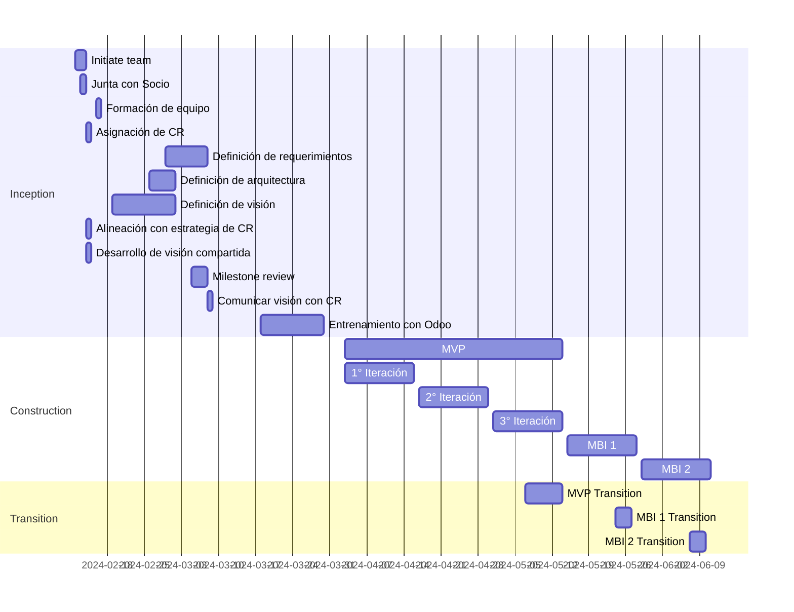
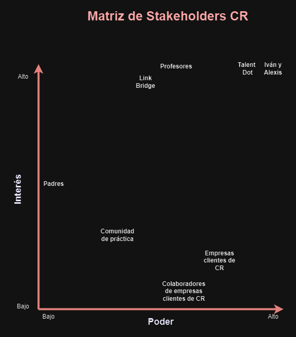

# Visión del Proyecto Talent 360

## Necesidad

Automatizar la aplicación de los diagnósticos organizacionales y la generación de reportes, a fin de profesionalizar nuestros servicios y ofrecerle una mejor experiencia al cliente

## Misión

Atender la ineficiencia en el proceso de diagnóstico de los colaboradores, junto con la falta de personalización en los formularios de captura de datos y en los planes de desarrollo.

## Objetivos

- Reducir en un 30% el tiempo invertido en la generación de reportes por parte del equipo dedicado a la consultoría y desarrollo organizacional de CR

## Entregables

- Código fuente
- Manual de usuario
- Perfil de desarrollador
- Plan de proyecto

## Ciclo de vida del proyecto

El proyecto seguirá el ciclo de vida básico de Disciplined Agile Delivery (DAD):

Este ciclo de vida consiste en tres fases:

### Inicio

Los objetivos de la fase de inicio son:

- Formar el equipo inicial
- Desarrollar una visión común
- Alinear el proyecto con la dirección de la empresa
- Explorar el alcance inicial
- Identificar la estrategia técnica inicial
- Desarrollar el plan inicial de liberaciones
- Asegurar el financiamiento
- Formar el ambiente de trabajo
- Identificar riesgos
- Desarrollar la estrategia inicial de pruebas

### Construcción

Los objetivos de la fase de construcción son:

- Probar la arquitectura temprano
- Producir una solución potencialmente consumible
- Encargarse de las necesidades cambiantes del stakeholder
- Mantener o mejorar los niveles existentes de calidad
- Acercarse a la visión desplegable

### Transición

- Los objetivos de la fase de transición son:
- Asegurarse que la solución está lista para producción
- Desplegar la solución hacia producción

## Stakeholders

| Categoría           | Encargado                                                                                                                                                                             |
| ------------------- | ------------------------------------------------------------------------------------------------------------------------------------------------------------------------------------- |
| Customer or Client  | CR Organizacional                                                                                                                                                                     |
| Project Core Team   | Black Dot                                                                                                                                                                             |
| Program Manager     | Olimpia Garcia y Daniel Fuentes                                                                                                                                                       |
| Product Owner       | Miguel Angel Tena                                                                                                                                                                     |
| Team Lead           | Carlos Velasco                                                                                                                                                                        |
| Architecture Owner  | Daniel Cajas                                                                                                                                                                          |
| Project Team Member | Juan Pablo Cabrera, David Langarica, Alejandra Cabrera, Uri Gopar, Maria Fernanda Moreno, Ricardo Rosales, José Riosmena, José Diego Llaca, Damariz Licea, Diego Vega, Diego Sandoval |

## Project Milestones

|                                                               | Fecha Esperada |
| ------------------------------------------------------------- | -------------- |
| ¿El stakeholder está de acuerdo con tu estrategia?            | 08/03/2024 - 11/03/2024 |
| ¿Realmente puedes construir la solución propuesta?            | 08/04/2024 - 12/04/2024 |
| ¿El proyecto sigue teniendo sentido?                          | 22/04/2024 - 26/04/2024 |
| ¿Tiene sentido liberar la solución actual?                    | 29/04/2024 - 03/05/2024 |
| ¿La solución va a funcionar en producción?                    | 05/05/2024 - 10/05/2024 |
| ¿Están contentos los stakeholders con la solución desplegada? | 03/06/2024 - 15/06/2024 |

## Iteraciones del proyecto

## Arquitectura
### Propuesta elegida: 
Utilizar la arquitectura de Odoo (framework de Python) debido a que los socios
formadores la utilizan en sus operaciones de empresa y nosotros, a pesar de no conocer la tecnología,
creemos que lo mejor es adaptarnos a su forma de trabajo, ya que una ventaja muy importante es que
podemos utilizar las funcionalidades ya existentes para desarrollar nuestro módulo de evaluaciones.

### Otras propuestas: 
Utilizar la arquitectura de React (biblioteca de Javascript) junto a un sistema de base
de datos (como MariaDB). Esta propuesta se rechazó debido a que consideramos que a largo plazo iba a
resultar muy costoso (nos íbamos a tardar mucho tiempo en desarrollar toda la solución) porque sería
empezar el proyecto desde cero (a comparación de utilizar Odoo) y entrenar a los stakeholders con las
nuevas tecnologías que implementaríamos.

## Matriz de Stakeholders CR

