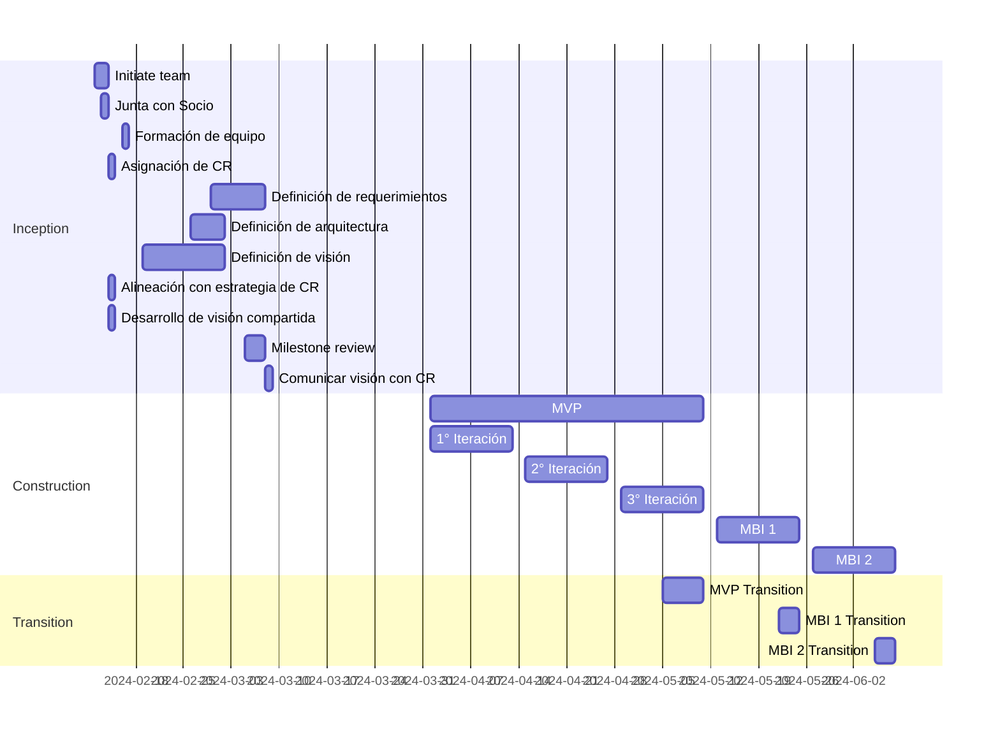

# Visión del Proyecto CR 

# Necesidad

Atender la ineficiencia en el proceso de diagnóstico de los colaboradores, junto con la falta de personalización en los formularios de captura de datos y en los planes de desarrollo.

# Objetivos

- Reducir en un 30% el tiempo invertido en la generación de reportes por parte del equipo dedicado a la consultoría y desarrollo organizacional de CR

# Entregables

- Código fuente
- Manual de usuario
- Manual de despliegue
- Perfil de desarrollador
- Descripción general del sistema

# Ciclo de vida del proyecto

El proyecto seguirá el ciclo de vida básico de Disciplined Agile Delivery (DAD):


Este ciclo de vida consiste en tres fases:

### Inicio
Los objetivos de la fase de inicio son:
* Formar el equipo inicial
* Desarrollar una visión común
* Alinear el proyecto con la dirección de la empresa
* Explorar el alcance inicial
* Identificar la estrategia técnica inicial
* Desarrollar el plan inicial de liberaciones
* Asegurar el financiamiento
* Formar el ambiente de trabajo
* Identificar riesgos
* Desarrollar la estrategia inicial de pruebas

### Construcción
Los objetivos de la fase de construcción son:
* Probar la arquitectura temprano
* Producir una solución potencialmente consumible
* Encargarse de las necesidades cambiantes del stakeholder
* Mantener o mejorar los niveles existentes de calidad
* Acercarse a la visión desplegable

### Transición
* Los objetivos de la fase de transición son:
* Asegurarse que la solución está lista para producción
* Desplegar la solución hacia producción


# Stakeholders

| Categoría          | Encargado |
| -------------------|-----------|
| Customer or Client | CR Organizacional |
| Project Core Team  | Black Dot |
| Program Manager    | Olimpia Garcia y Daniel Fuentes |
| Product Owner      | Miguel Angel Tena |
| Team Lead          | Carlos Velasco |
| Architecture Owner | Daniel Cajas |
| Project Team Member | Juan Pablo Cabrera, David Langarica, Alejandra Cabrera, Uri Gopar, Maria Fernanda Moreno, Ricardo Rosales, José Riosmena, José Diego Llaca, Damariz Licea, Diego Vega, Diego Sandoval |

# Project Milestones

| | Fecha Esperada |
|-|----------------|
| ¿El stakeholder está de acuerdo con tu estrategia? | |
| ¿Realmente puedes construir la solución propuesta? | |
| ¿El proyecto sigue teniendo sentido? | |
| ¿Tiene sentido liberar la solución actual? | |
| ¿La solución va a funcionar en producción? | |
| ¿Están contentos los stakeholders con la solución desplegada? |  |

# Iteraciones del proyecto 


# Arquitectura 

```
Falta por agregar 
```

# Riesgos 

[Plan de Riesgos](https://docs.google.com/spreadsheets/d/1qlkNWrnsY4GdnN6vlMMmOpeQMdMY4EydTHZ9DmPvUGE/edit?usp=sharing)
